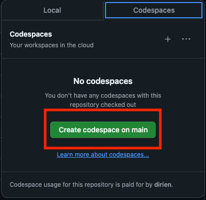

# Build Your Developer Platform in 90 Minutes - Backstage + ArgoCD + K8s

This repository contains everything you need to follow along with the "Build Your Developer Platform in 90 Minutes -
Backstage + ArgoCD + K8s" workshop during [DevOpsDays TLV 2024](https://tlvcommunity.dev/devopsdays/agenda-2024).

The main goal of this workshop is to show how to build a developer platform using `Backstage`, `ArgoCD`, and
`Kubernetes` and give you a glimpse of how this tools work and how you can use these tools to build your own developer
platform.

## Repository

Please fork this repository to your own GitHub account to follow along with the workshop. You can do this by clicking on
this link:

[](https://github.com/dirien/backstage-demo/fork)

This repository contains all the resources that are needed to follow along with the workshop. Additionally, it contains
a `.devcontainer` configuration that allows you to run the workshop in a containerized environment. You can choose from
several options to run the workshop:

1. **Local Environment**: You can run the workshop on your local machine.
1. **GitHub Codespaces**: You can run the workshop in a GitHub Codespace.

### `.devcontainer` Configuration

The `.devcontainer` configuration is used to create a containerized environment for the workshop. It contains all the
tools and dependencies that are needed to run the workshop.

All you need to do is, after forking the repository, decide what remote environment you want to use.

#### GitHub Codespaces

If you prefer to use `GitHub Codespaces` you can click on the `Code` button in the top right corner of the repository
and select `Open with Codespaces`. If you prefer to use a local environment you can follow the instructions below.



#### Local Environment

First, you need to clone the repository to your local machine:

```bash
git clone <your-forked-repository URL>
```

And you need to have on your local machine Visual Studio Code and
the [Dev Containers extension](https://marketplace.visualstudio.com/items?itemName=ms-vscode-remote.remote-containers)
from the Visual Studio Code Marketplace installed.

## Prerequisites

Before you start the workshop, make sure you have the following tools installed on your machine:

> **Note**: We highly recommend using the `.devcontainer` configuration to run the workshop as you do not need to
> install any of the tools below.

| Name       | Required | More info                                                  |
|------------|----------|------------------------------------------------------------|
| civo CLI   | No       | https://github.com/civo/cli\                               |
| Pulumi CLI | Yes      | https://www.pulumi.com/docs/iac/download-install/\         |
| gitHub CLI | Yes      | https://cli.github.com/                                    |
| yq         | Yes      | https://github.com/mikefarah/yq#install                    |
| kubeseal   | Yes      | https://github.com/bitnami-labs/sealed-secrets#kubeseal    |
| Helm       | Yes      | https://github.com/helm/helm#install                       |
| kubectl    | Yes      | https://github.com/kubernetes/kubectl                      |
| argocd-cli | Yes      | https://argo-cd.readthedocs.io/en/stable/cli_installation/ |

### Pulumi Account

As part of the Pulumi CLI installation, you will need to create a free Pulumi account to host your state files. Please
head over to [Pulumi](https://app.pulumi.com/signup) and create your free personal account.

### Civo Account (Optional)

We will be using [Civo](https://www.civo.com/) as our Kubernetes provider. If you want you can create
a [Civo account](https://dashboard.civo.com/signup) with a free $250 credit to use for the workshop.

Otherwise, we will provider you an API key to use for the workshop, this will be provided during the workshop.

> **Note**: After the workshop, we will delete all the resources created during the workshop to avoid any charges. If
> you want to keep the resources please use your own Civo account.

## Workshop

The workshop is divided into several steps. For each step, we created separate shell scripts that you can run to get the
desired result. The steps are as follows:

### Create Cluster

Here we will create a Kubernetes cluster using Civo. Don't worry, we will provide you with an API key to use for the
workshop.

Run this command and follow the instructions inside the terminal:

```bash
./clusters.sh
```

If you are done with the cluster creation, you can move on to the next step.

### Set up the Environment

In this step we will set up ArgoCD so it can be used to point to your forked repository and is accessible from the
internet.

Run this command and follow the instructions inside the terminal:

```bash
./setup.sh
```

### Run the actual demo

In this step we will install all the required components to run Backstage on the Kubernetes cluster. This will be not an
one-click script, because we want to show you how to install the components step by step and what they are doing and
interacting.

So head to the [demo.md](demo.md) file and follow the instructions there.

### Cleanup

After the workshop, you can run the cleanup script to remove all the resources created during the workshop.

```bash
./cleanup.sh
```

### זמן למסיבה 

Congratulations! You have successfully completed the workshop. We hope you enjoyed it and learned something new.

## Troubleshooting Tips

If you encounter any challenges during the workshops, consider the following steps in order:

1. Don't hesitate to reach out to us! We are here to assist and get you back on track.
1. Review the example code available [here](https://github.com/dirien/backstage-demo.git).
1. Search for the error on Google. Honestly, this method often provides the most insightful solutions.
